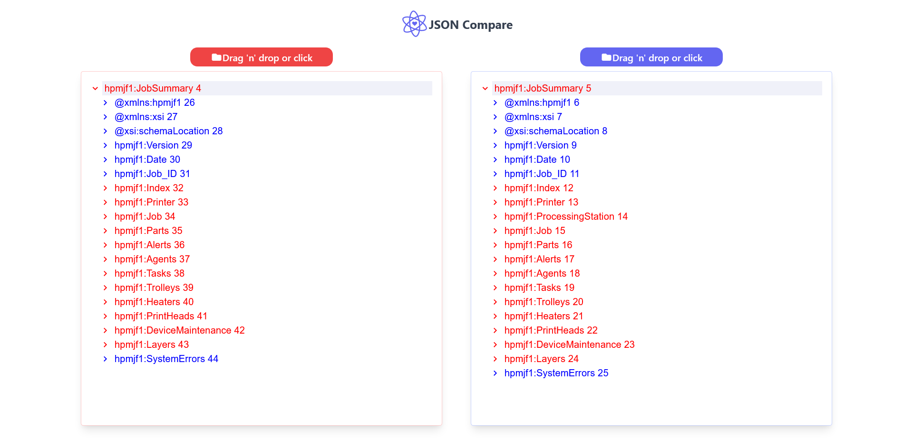

# JSON tool

TypeScript+React JSON comparison tool </br>
See live https://munikeraragon.github.io/json-compare/


<div align="center">


</div>


## Usage
1. Clone the repository
```
git clone https://github.com/munikeraragon/json-compare.git
```
2. install dependencies
```
npm install
```
3. start app
```
npm run start
```
